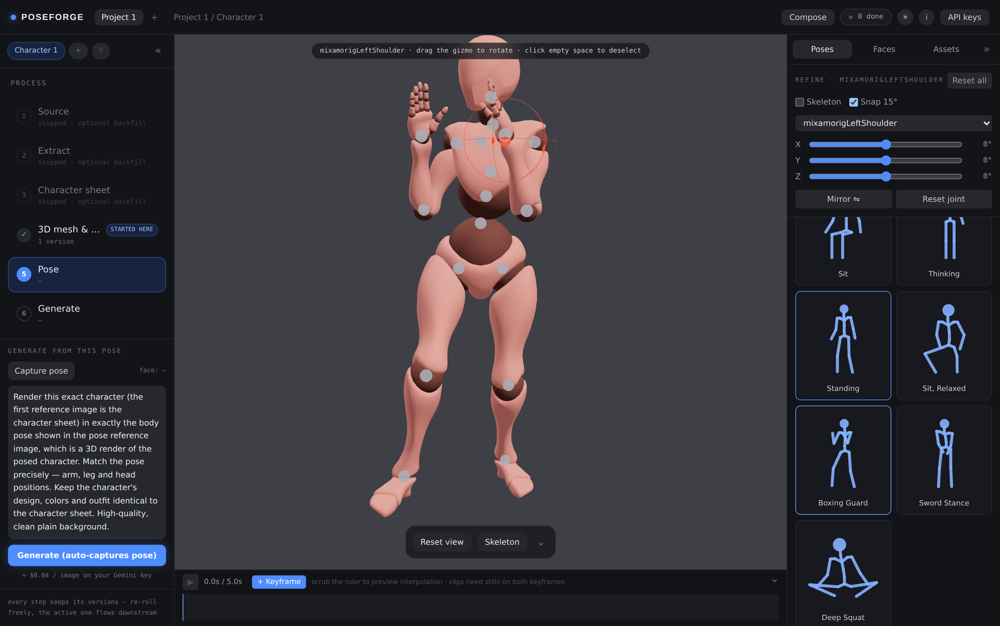
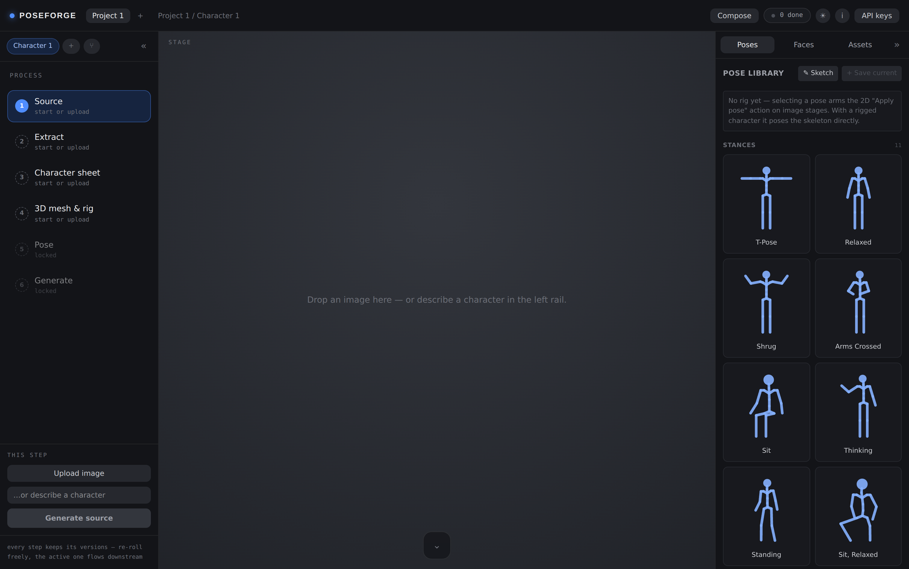
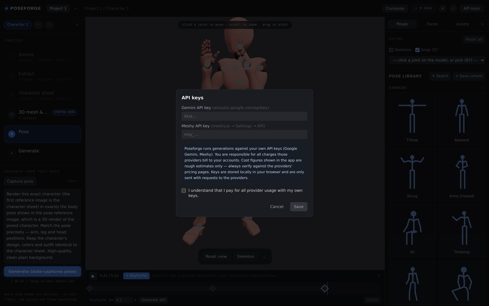
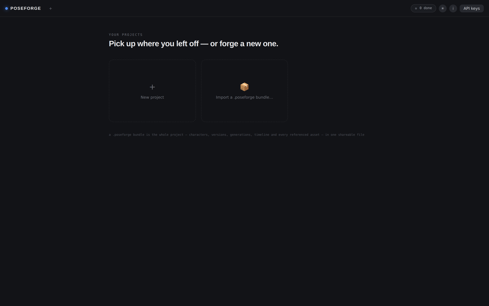
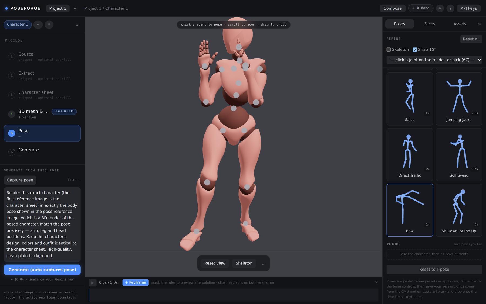
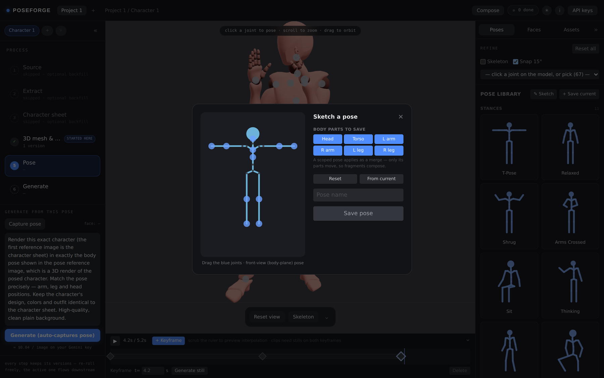
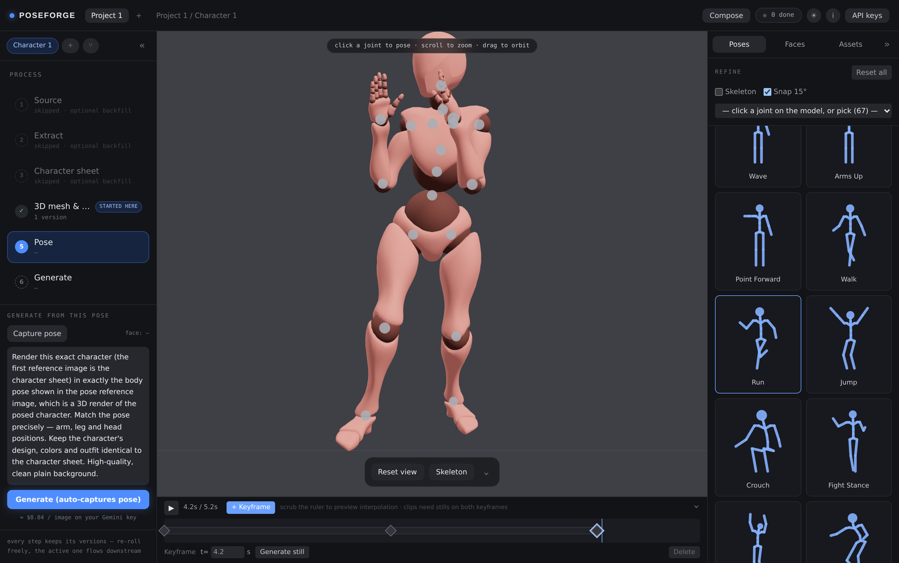
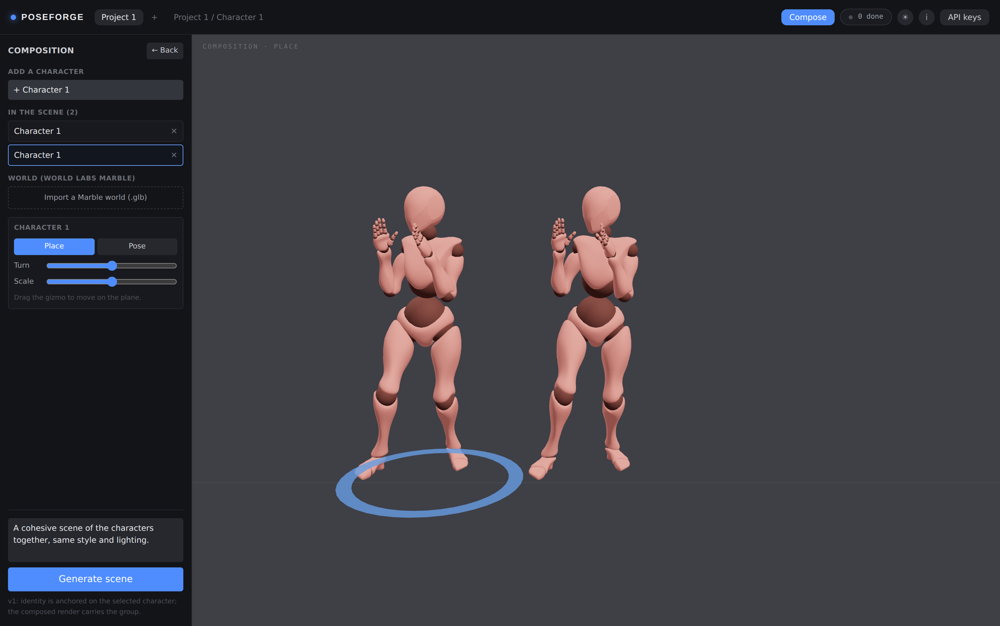
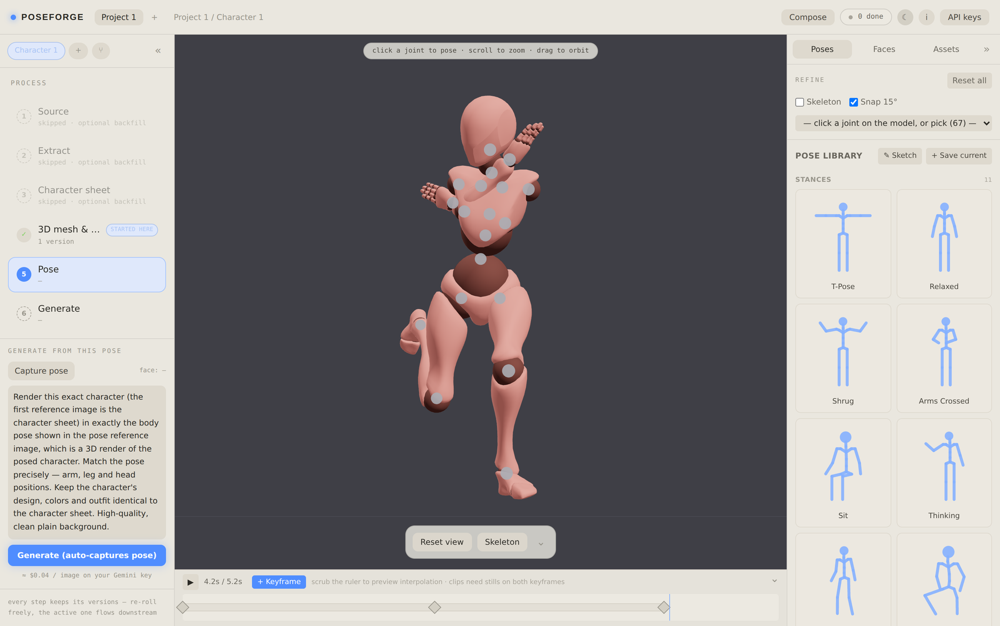

# Poseforge

**Turn one image into a rigged 3D character, pose it, and render it into new images and video — all in the browser, on your own API keys.**

<p align="center">
  
</p>

<p align="center">
  <a href="#license"></a>
  
  
  
  
  
  
  
</p>

Poseforge is a local-first gen-AI character studio. Drop in a reference image (or a text prompt), and it walks the character through a full pipeline: isolate it, build a front/side/back turnaround, generate a 3D mesh and auto-rig it, then hand you a three.js editor to pose the skeleton directly. The posed render becomes the conditioning signal for image generation (nano-banana) and keyframe-to-keyframe video (Veo). The rigged GLB, the poses, and the animation clips are all first-class exports — not throwaway intermediates.

Everything runs in your browser. There's no backend, no account, and no data leaves your machine except the provider calls you trigger with your own keys.

---

## Contents

- [The pipeline](#the-pipeline)
- [Run it](#run-it)
  - [Add your API keys](#add-your-api-keys)
- [A tour of the workspace](#a-tour-of-the-workspace)
  - [1 · Start a project](#1--start-a-project)
  - [2 · Build the character](#2--build-the-character-source--mesh--rig)
  - [3 · Pose it](#3--pose-it)
  - [4 · Animate](#4--animate-timeline)
  - [5 · Generate stills](#5--generate-stills)
  - [6 · Compose a scene](#6--compose-a-scene-multi-character--marble-worlds)
  - [7 · Assets & lineage](#7--assets--lineage)
  - [8 · Save & share](#8--save--share)
- [How it works](#how-it-works)
- [Exports](#exports)
- [Status](#status)
- [Contributing](#contributing)
- [License](#license)

---

## The pipeline

```
Source ─▶ Extract ─▶ Character sheet ─▶ Mesh & rig ─▶ Pose ─▶ Generate
 image     isolate     front/side/back    Meshy 3D +   three.js   nano-banana
 or prompt  the char    turnaround         auto-rig     editor     image / Veo video
```

Every step keeps a **stack of versions** with an active pointer — re-roll freely; the active version flows downstream and anything stale is flagged (never wiped). And you can **start at any step** — upload a character-on-white image straight into Extract, seed a sheet, or drop in your own GLB and go straight to rigging.

<p align="center">
  
  <br>
  <em>The workspace: a fixed <strong>Process · Stage · References</strong> shell. The pipeline lives on the left, the current step's output fills the center, and reference material (poses, faces, assets) sits on the right.</em>
</p>

---

## Run it

```bash
git clone https://github.com/wolfgangjblack/poseforge
cd poseforge
npm install
npm run dev
```

Open <http://localhost:3000>. Requires **Node 18.18+** (Next.js 15) and a browser with WebGL2 + IndexedDB (any current Chrome / Edge / Firefox / Safari).

### Add your API keys

Click **API keys** in the top bar and paste your own:

- **Gemini API key** — create free at [aistudio.google.com/apikey](https://aistudio.google.com/apikey). The image (nano-banana) and video (Veo) models need a **billing-enabled** Google Cloud project — the free tier caps image generation at 0.
- **Meshy API key** — [meshy.ai](https://www.meshy.ai) → Settings → API. Used for image→3D and auto-rigging.

Keys live only in your browser (IndexedDB) and are sent solely to the providers through the app's own stateless proxy routes.

<p align="center">
  
</p>

> ⚠️ **Bring your own keys — you pay for all provider usage.** Every mesh, rig,
> image, and video runs against *your* keys and is billed to you. The in-app cost
> hints (e.g. "≈ $0.04 / image") are rough estimates; check the providers'
> pricing pages. A first Veo clip in fast mode is ≈ <$1.

---

## A tour of the workspace

The workspace is three columns: the **Process** rail (left, the pipeline + the current step's actions), the **Stage** (center, what the step produces), and **References** (right — Poses / Faces / Assets). A bottom **Timeline** deck appears on the Pose step.

### 1 · Start a project

On the launcher, click **New project** (or reopen an existing one). Each project can hold multiple characters — switch or add them with the chips at the top of the Process rail, and **⑂ fork** a character to evolve variants (e.g. "angry" and "sad") in parallel off shared upstream stages.

<p align="center">
  
</p>

### 2 · Build the character (Source → Mesh & Rig)

Walk down the Process rail. Each step's actions live in the left rail under the step list:

- **Source** — drop/upload an image, or type a prompt and **Generate source** (nano-banana).
- **Extract** — isolate the character onto a clean background, or **Upload instead** if you already have a character on white.
- **Character sheet** — build a front/side/back T-pose turnaround (conditions the 3D).
- **3D mesh & rig** — **Generate mesh** (Meshy multi-image→3D), then **Rig character** (Meshy auto-rig). Or **Upload GLB / Upload rigged** to bring your own.

**Start anywhere:** you don't have to begin at Source. Seed any step from an upload or from the Assets library (see §7). When you start partway, the skipped upstream steps gray out as *"skipped · optional backfill"* and the entry step is badged **★ started here** — you can always backfill an earlier stage later.

Meshy jobs are durable: close the tab mid-mesh and the app resumes polling when you reopen it.

### 3 · Pose it

With a rigged character on the **Pose** step:

- **Direct manipulation** — click a joint marker, drag the gizmo to rotate (toggle 15° snap), **mirror** left↔right, or reset a joint / all. Fine-tune exact angles with the bone sliders in the References rail.
- **Pose library** (References → **Poses**) — grouped into **Stances / Actions / Clips / Yours**. Built-in presets plus ~25 poses and 12 animation clips from the CMU motion-capture database. Click a pose to apply it; click a **Clip** to drop its keyframes onto the timeline.
- **Sketch your own** — **✎ Sketch** opens a 2D stick figure: drag the joints (drag the hand to bend the elbow, the elbow to swing the arm), scope the pose to body parts (arms / legs / torso / head), name it, and save. Scoped poses apply as a *merge* — only their joints move — so fragments compose (an arm wave on top of a stance).
- **Pre-rig (2D) posing** — even before you rig, selecting a pose or a face arms an **Apply pose / Apply face (2D)** action that re-poses the flat image via chained nano-banana img2img.

<p align="center">
  
  <br>
  <em>The pose library is a series of skeletons — hand-authored presets plus poses and clips sampled from the CMU motion-capture database.</em>
</p>

<p align="center">
  
  <br>
  <em>Sketch a pose by dragging the joints of a 2D stick figure, scope it to body parts, and save it. With a rigged character loaded, the sketch drives the 3D skeleton live as you drag.</em>
</p>

### 4 · Animate (Timeline)

The Timeline deck on the Pose step:

1. Pose the character, hit **+ Keyframe** to drop it at the playhead (or apply a **Clip** for a batch of keyframes). Scrub the ruler to preview the client-side slerp interpolation.
2. **Generate still** on each keyframe (nano-banana renders the posed frame).
3. Select the segment between two keyframes-with-stills and **Generate clip (Veo)** — it interpolates first-frame→last-frame into video.
4. **Trim** any clip with the in/out handles (non-destructive), then **⬇ Export video** to stitch all segment clips into one MP4 (ffmpeg.wasm, entirely client-side).

<p align="center">
  
</p>

### 5 · Generate stills

Pose the character, then **Generate** (it auto-captures the viewport as the pose reference). nano-banana renders a new image conditioned on the character sheet + the posed render + your prompt. No sheet? It generates from the render alone. Pick a face in **References → Faces** first to set the expression, and **Refine face** for a second img2img pass on a result.

### 6 · Compose a scene (multi-character + Marble worlds)

Click **Compose** in the top bar:

- **Add** the project's rigged characters to a ground plane. Select one to **Place** (move / turn / scale) or **Pose** it in place with the same joint gizmo.
- **Import a Marble world (.glb)** — export a scene from [World Labs Marble](https://www.worldlabs.ai) and drop it in as a backdrop; fit it with the scale / height / turn sliders.
- **Generate scene** renders the composed group (in the world) as one nano-banana image.

<p align="center">
  
</p>

### 7 · Assets & lineage

Every asset the project touched, grouped by character (References → **Assets**). Drill into one and select an asset to:

- **Insert it** into the current character (or a new project) *as* any stage — the other way to start from a later phase.
- See **Used in** — every character / stage / generation / keyframe / clip that references it (assets are content-addressed, so a reused image shows all its usages; each row jumps to that character).
- See **Made from** — for a generated image, the input refs it came from, so you can trace an output back through its lineage.

### 8 · Save & share

Everything is local. From the launcher, **Download** a project as a portable **`.poseforge`** bundle (the whole project — characters, versions, generations, timeline, and every referenced asset — in one file) and **Import** to open it elsewhere. Rigged characters also export as **GLB**, generations as **PNG**, and the timeline as **MP4**.

Prefer to work in daylight? A **light mode** toggle (☀ / ☾ in the top bar) swaps the whole theme; the neutral-gray 3D stage stays constant since that render doubles as the pose-reference image.

<p align="center">
  
</p>

---

## How it works

Poseforge is a **Next.js (App Router) + TypeScript** app, designed local-first so it can later deploy to Cloudflare unchanged:

- **All state is client-side.** Assets, characters, jobs, generations, the timeline, and your keys live in **IndexedDB (Dexie)**. Blobs are **content-addressed** by SHA-256, so re-generations dedupe and bundles diff cleanly. There is no server-side state.
- **API routes are stateless proxies.** `/api/gemini/*` and `/api/meshy/*` forward requests with your key attached — `fetch`-only, no Node-native deps, Workers-compatible.
- **Heavy work runs in the browser.** three.js / react-three-fiber for the viewport, rigging, and composition; **ffmpeg.wasm** (lazy-loaded, single-threaded core) for video stitching. Nothing that touches your media leaves your machine except the provider calls you trigger.
- **Expensive calls are durable jobs.** Meshy mesh/rig and Veo tasks are recorded with a provider task id and resume on reload.
- **Providers:** Gemini (nano-banana images + Veo video), Meshy (image→3D + auto-rig), World Labs Marble (imported environments). Characters are always rigged Meshy meshes; splats/worlds are backdrops.

Fonts are Space Grotesk + IBM Plex; the visual system is documented in [`design_handoff_workspace_redesign/`](./design_handoff_workspace_redesign). Full architecture and roadmap live in [DESIGN.md](./DESIGN.md) and [ROADMAP.md](./ROADMAP.md).

---

## Exports

Rigged character **GLB** · generated **PNG** stills · stitched timeline **MP4** · composed-scene stills · the full **`.poseforge`** project bundle.

---

## Status

The full pipeline works end-to-end on real keys: source → extract → 3-view sheet → Meshy multi-image mesh → auto-rig → direct-manipulation posing → nano-banana generation, plus the animation timeline (Veo interpolation, trim, stitched export), CMU mocap import, 2D pose sketching, multi-character composition, and Marble world drop-in. **Hosting is deferred** (funding-gated) — Poseforge ships as a clone-and-run local app; see [ROADMAP.md](./ROADMAP.md) for what's next.

> The screenshots above were captured from a live build using an off-the-shelf
> rigged GLB in place of a Meshy-generated character, so you can see the pose,
> animation, and composition tools without spending any provider credits.

### Status (checkup 2026-08-18)
> Revisado na campanha de repo-checkup. Relatorio completo: `~/repo-checkup/reports/poseforge.md` (local do mantenedor, nao no repo).
- **Build/Install**: PASS — `npm ci` RC=0 (118 pacotes); `npm run build` compila (Next.js 15.5.23, 9 rotas estaticas); `npm run typecheck` (`tsc --noEmit`) RC=0.
- **Smoke test**: N/A (sem script de teste; build gera 9 rotas estaticas; typecheck RC=0).
- **Para rodar de ponta-a-ponta precisa de**: chaves de API Gemini/Meshy (rotas proxy stateless, nao persistidas); nenhum servico externo obrigatorio para o build.
- **Inconsistencias conhecidas (README vs codigo)**: `.gitignore` ignorava `.github/workflows/ci.yml` (corrigido no checkup).
- **Seguranca**: 3 high (`next`, `postcss`, `sharp`) exigem `next@16.3.1` (BREAKING) -> NAO aplicado (decisao humana); 1 high (`nanoid`) resolvida por `npm audit fix` nao-force. Secret scan: 0 hits.
- **Estado resumido**: build verde (Next 15.5.23) + typecheck; ESLint ausente (warning nao fatal); 3 high pendentes (upgrade breaking do Next).

---

## Contributing

Contributions are welcome — whether it's a bug fix, a new pose pack, a provider adapter, or docs.

**Found a bug or have an idea?** [Open an issue](https://github.com/wolfgangjblack/poseforge/issues). Helpful bug reports include your browser + OS, what you did, what you expected, what happened, and any errors from the in-app **Jobs** tray or the browser console. For features, describe the workflow you're trying to unlock.

**Sending a pull request?**

```bash
# fork, then:
git clone https://github.com/<you>/poseforge
cd poseforge
npm install
npm run dev          # http://localhost:3000

npm run typecheck    # tsc --noEmit — keep it green
npm run build        # verify a production build (stop the dev server first)
```

A few conventions worth knowing before you dig in:

- **All provider calls stay in the stateless `fetch`-only API routes** (`app/api/*`) so the app remains Cloudflare Workers-compatible — no Node-native server deps.
- **Every expensive call gets a durable job** (`JobRow`); Meshy/Veo operations resume by provider task id on reload.
- **Pose math is world-space and rig-independent.** If you touch it, verify with the Node/three.js test scripts in `scripts/` rather than by eye — hidden preview tabs throttle rendering.
- **Don't run `npm run build` while the dev server is up** (it can corrupt `.next`; `rm -rf .next` and restart to recover).
- Keep `npm run typecheck` clean, and prefer small, focused commits.

New pose and animation content should come from **freely-licensed** sources (the bundled pack is derived from the CMU database, free for any use). Please don't add Mixamo or AMASS content as a redistributed library — their licenses don't allow it.

See [DESIGN.md](./DESIGN.md) for the architecture and [ROADMAP.md](./ROADMAP.md) for where things are headed.

---

## License

**MIT** — see [LICENSE](./LICENSE). The bundled pose/clip pack is derived from the **CMU Graphics Lab Motion Capture Database**, which is free to use for any purpose including commercial. Model outputs are yours, subject to the Gemini and Meshy terms you accept with your keys.
